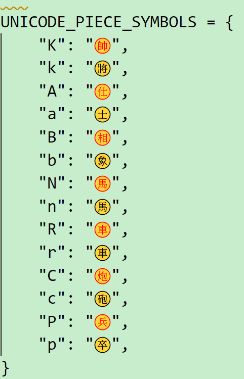

# 中国象棋

## 预先准备

### 中国象棋字体

在[babelstone](https://www.babelstone.co.uk/Fonts/Xiangqi.html)下载`ttf`格式文件，以此作为中国象棋字体。或者直接使用源文件中的`黑白棋子字体`(data/BabelStoneXiangqi.ttf)或者`彩色棋子字体`(data/BabelStoneXiangqiColour.ttf)。

- windows
  
```cmd
# 将ttf文件复制到`C:\Windows\Fonts`文件夹
```
- 如在WSL2环境下执行以下命令更新字体缓存, 系统才能识别到该新字体
  
```bash
sudo fc-cache -fv
```
- Vs code 显示

VS Code的设置(Ctrl/Cmd + ,),在“设置”面板中添加:
```vs code
"editor.fontFamily": "BabelStone Xiangqi Colour"
<!-- 如不需要彩色，去掉Colour -->
"editor.fontFamily": "BabelStone Xiangqi"
```

在`VS code`最终显示结果应为



非windows系统参照以上步骤